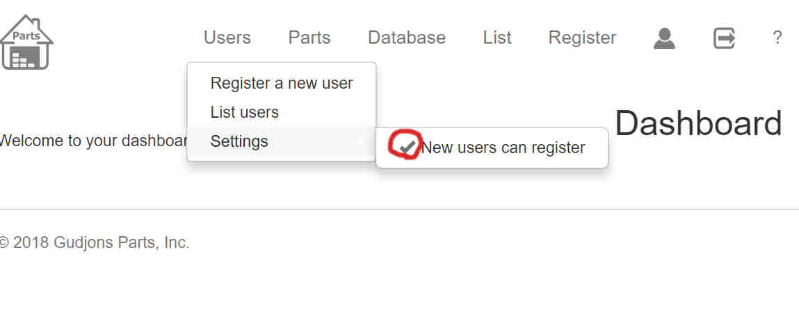

# Node.js GParts

Online storage application to store information about various parts. Specially parts I use when having fun with micro-controllers like Arduino, Esp32 and Esp2866(nodeMcu).

Now when the project is finished, I logged all my parts I've bought over the years and logged all information I have on them. This will make things easier when starting a new arduino project, I can read about the part and how to use it. Click on stored data-sheets, or visit links that are stored on the parts page.

The project page can be found [here](http://www.guttih.com/projects/gparts).

### Version
1.0.0


### requirements:
You will need to install the following if you haven't already.
+ [MongoDb](https://www.mongodb.com) To store data. ([Install tutorials](https://docs.mongodb.com/manual/installation/) or [installing with package manager](https://nodejs.org/en/download/package-manager/#debian-and-ubuntu-based-linux-distributions) ) 
+ [Node.js](https://nodejs.org/en/) To run the app


### Usage


### Installation

GParts requires [Node.js](https://nodejs.org/) v4+ to run.

In the root of gparts folder, type the following
```sh
$ npm install
$ npm start
```

### First tasks
1. Type into a web browser `http://localhost:6300/`
2. Create a user who is a administrator
3. Login as that user
4. Stop other users to register
<div style="text-align:center">
  
</div>
